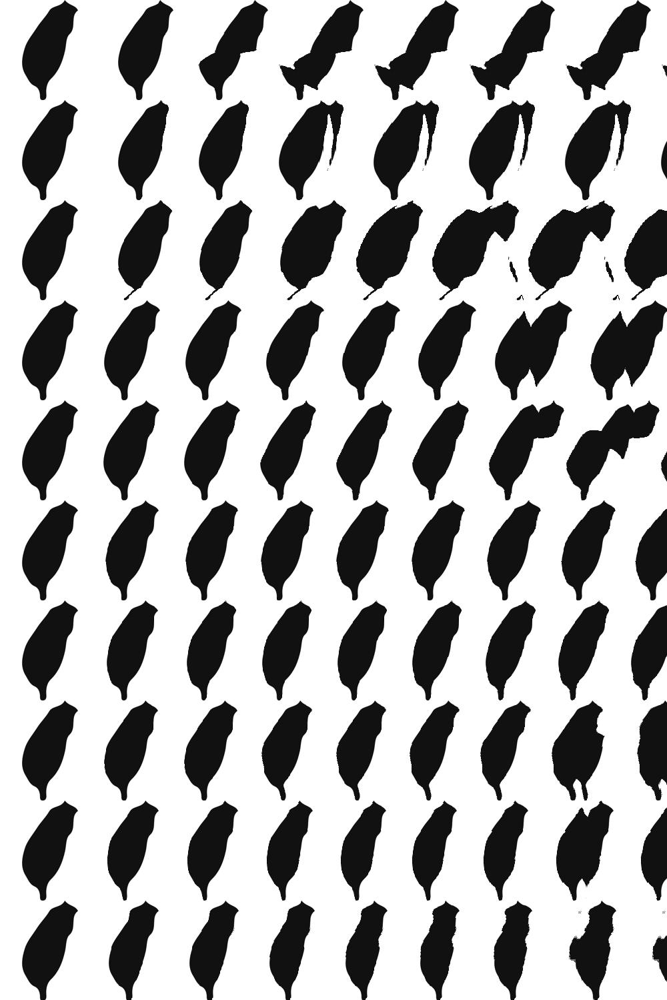

# MagicEye Generator

## Setup

    $ pip install -r requirements.txt
        
## Usage

    magiceye.py [-h] [--shift SHIFT] [--output-size OUTPUT_SIZE] [--pattern-size PATTERN_SIZE] [--show] [--output OUTPUT] depth pattern

    positional arguments:
      depth                 File with the depth map
      pattern               File with the background pattern

    optional arguments:
      -h, --help            show this help message and exit
      --shift SHIFT         How much to shift the depth map
      --output-size OUTPUT_SIZE
                            Size of output image
      --pattern-size PATTERN_SIZE
                            Size of pattern image
      --show                Whether to display image
      --output OUTPUT       The output file
    
## Results

    $ python magiceye.py depth/family.png tiles/taiwan.jpg --output-size=1000 --pattern-size=150 --shift=0.3 --show

